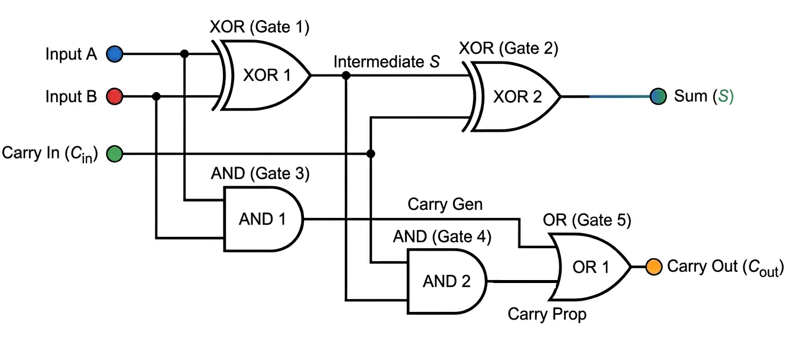

# Investigation of VLSI Circuits Across Emerging Transistor Technologies

## A Comparative Study of 45nm CMOS and 7nm Virtual-Source Carbon Nanotube FET

<p align="center">
  <b>Cadence Virtuoso · Spectre · GPDK045 · Stanford VS-CNFET · Verilog-A</b>
</p>

<p align="center">
  <a href="#overview">Overview</a> •
  <a href="#circuits-investigated">Circuits</a> •
  <a href="#simulation-methodology">Methodology</a> •
  <a href="#results">Results</a> •
  <a href="#key-observations">Observations</a> •
  <a href="docs/REFERENCES.md">References</a>
</p>

---

## Overview

This project presents a circuit-level investigation of digital VLSI circuits
implemented using conventional **45nm CMOS** and emerging **7nm Virtual-Source
Carbon Nanotube Field-Effect Transistor (VS-CNFET)** technologies.

The objective is not simply to determine which transistor technology is
"better." Instead, the study investigates two interacting optimization
dimensions:

1. **Device technology** — 45nm CMOS vs. 7nm VS-CNFET
2. **Circuit topology** — conventional 38T static logic vs. 10T
   pass-transistor logic

Three circuits were designed, simulated, and characterized:

- Inverter
- 38-transistor static full adder
- 10-transistor pass-transistor-logic full adder

The simulations were performed in **Cadence Virtuoso/Spectre** using
**GPDK045** for the CMOS implementations and the **Stanford Virtual-Source
CNFET compact model v1.0.1** for the VS-CNFET implementations
[[1]](docs/REFERENCES.md#1-stanford-virtual-source-cnfet-model)
[[2]](docs/REFERENCES.md#2-virtual-source-compact-model).

The comparison evaluates:

`Propagation Delay` · `Dynamic Power` · `Static Power` · `PDP` · `EDP` ·
`Peak Current` · `Noise Margin` · `Output Swing` · `Maximum-Frequency Estimate`

> **Central result:** Device technology strongly influences achievable
> switching speed, while circuit topology can dominate power and
> energy-efficiency behavior.

---

## Performance at a Glance

### Inverter

| Metric | 45nm CMOS | 7nm VS-CNFET |
|---|---:|---:|
| Supply voltage | 1.0 V | 0.71 V |
| `tpHL` | 17.22 ps | **3.895 ps** |
| `tpLH` | 22.52 ps | **3.894 ps** |
| Average `tpd` | 19.87 ps | **3.895 ps** |
| Dynamic power | **5.953 µW** | 7.337 µW |
| PDP | 118.29 aJ | **28.57 aJ** |
| Peak current | 41.1 µA | **493.4 µA** |

The evaluated VS-CNFET inverter achieved approximately a **5.1× reduction in
average propagation delay** relative to the 45nm CMOS inverter.

---

### Full Adders

| Metric | CMOS 38T | VS-CNFET 38T | CMOS 10T | VS-CNFET 10T |
|---|---:|---:|---:|---:|
| VDD | 1.0 V | 0.71 V | 1.0 V | 0.71 V |
| Transistors | 38 | 38 | 10 | 10 |
| `tpHL` | 22.57 ps | 8.302 ps | 18.806 ps | **7.648 ps** |
| `tpLH` | 26.78 ps | **9.243 ps** | 18.775 ps | 12.632 ps |
| Average `tpd` | 24.67 ps | **8.773 ps** | 18.791 ps | 10.14 ps |
| Dynamic power | 1.573 µW | 11.80 µW | **184.23 nW** | 784.96 nW |
| Static power | 137.99 pW | 262.86 nW | **45.50 pW** | 80.87 nW |
| PDP | 38.80 aJ | 103.517 aJ | **3.462 aJ** | 7.960 aJ |
| EDP | 957.3 × 10⁻³⁰ J·s | 908.2 × 10⁻³⁰ J·s | **65.05 × 10⁻³⁰ J·s** | 80.71 × 10⁻³⁰ J·s |
| `fmax` estimate | 20.27 GHz | **56.99 GHz** | 26.61 GHz | 49.31 GHz |
| Max. Sum voltage | 1.071 V | 759.95 mV | 1.180 V | 828.17 mV |

These values are taken from the final circuit simulations and derived
measurements used in the study.

---

## Technology Platforms

| Parameter | 45nm CMOS | 7nm VS-CNFET |
|---|---|---|
| Device technology | Silicon MOSFET | Carbon Nanotube FET |
| Technology/model | Cadence GPDK045 | Stanford VS-CNFET v1.0.1 |
| Channel | Silicon | (10,0) zigzag CNT |
| Gate length | 45 nm | 10 nm |
| CNT diameter | — | 0.783 nm |
| CNT pitch | — | 10 nm |
| Supply voltage | 1.0 V | 0.71 V |
| Simulator | Cadence Spectre | Cadence Spectre |
| Design environment | Cadence Virtuoso | Cadence Virtuoso |
| Model interface | PDK | Verilog-A |

The VS-CNFET implementation uses the Stanford Virtual-Source compact-model
framework developed for aggressively scaled CNFET simulation
[[1]](docs/REFERENCES.md#1-stanford-virtual-source-cnfet-model)
[[2]](docs/REFERENCES.md#2-virtual-source-compact-model).

Detailed model parameters are documented in
[`docs/MODEL_CONFIGURATION.md`](docs/MODEL_CONFIGURATION.md).

---

## Circuits Investigated

### 1. Inverter

The inverter establishes the baseline switching characteristics of the two
device technologies.

#### Schematics

<table>
<tr>
<th align="center">45nm CMOS</th>
<th align="center">7nm VS-CNFET</th>
</tr>
<tr>
<td></td>
<td></td>
</tr>
</table>

#### Testbenches

<table>
<tr>
<th align="center">45nm CMOS</th>
<th align="center">7nm VS-CNFET</th>
</tr>
<tr>
<td></td>
<td></td>
</tr>
</table>

#### DC Characteristics

<table>
<tr>
<th align="center">45nm CMOS</th>
<th align="center">7nm VS-CNFET</th>
</tr>
<tr>
<td></td>
<td></td>
</tr>
</table>

#### Propagation-Delay Measurement

<table>
<tr>
<th align="center">45nm CMOS</th>
<th align="center">7nm VS-CNFET</th>
</tr>
<tr>
<td></td>
<td></td>
</tr>
</table>

### Inverter Characterization

The measured average propagation delay decreased from **19.87 ps** for
45nm CMOS to **3.895 ps** for the VS-CNFET implementation.

At the same time, the measured dynamic power increased from **5.953 µW**
to **7.337 µW**.

Consequently, the VS-CNFET inverter achieved the lower PDP:

- CMOS: **118.29 aJ**
- VS-CNFET: **28.57 aJ**


<details>
<summary><b>Additional inverter characterization</b></summary>

### Drive Current


### Power-Delay Product


### Static Power


### Noise Margin


### Output Swing


</details>

---

### 2. 38T Static Full Adder

The 38T implementation provides a conventional static complementary-logic
baseline for evaluating the influence of device technology.

#### Full-Adder Logic



#### Schematics

<table>
<tr>
<th align="center">45nm CMOS</th>
<th align="center">7nm VS-CNFET</th>
</tr>
<tr>
<td></td>
<td></td>
</tr>
</table>

#### Functional Verification

<table>
<tr>
<th align="center">45nm CMOS</th>
<th align="center">7nm VS-CNFET</th>
</tr>
<tr>
<td></td>
<td></td>
</tr>
</table>

### 38T Results

Average propagation delay decreased from:

```text
24.67 ps → 8.773 ps
```

corresponding to approximately a **2.81× reduction in delay**.

However, measured dynamic power increased from:

```text
1.573 µW → 11.80 µW
```

and PDP increased from:

```text
38.80 aJ → 103.517 aJ
```

under the evaluated simulation conditions.

<table>
<tr>
<td></td>
<td></td>
</tr>
</table>

<details>
<summary><b>Additional 38T characterization</b></summary>

### Power-Delay Product


### Static Power


</details>

---

### 3. 10T Pass-Transistor-Logic Full Adder

The reduced-transistor-count design investigates the effect of
**logic-topology optimization** in addition to device scaling.

The implementation consists of:

- an **8-transistor differential XOR-MUX Sum section**;
- a **2-transistor Cout transmission-gate section**.

The critical `Cin → Sum` path traverses substantially fewer series devices
than the corresponding path in the 38T architecture.

Reduced-transistor-count and pass-transistor full-adder architectures have
also been investigated in prior low-power VLSI work
[[11]](docs/REFERENCES.md#11-high-performance-cmos-full-adder)
[[13]](docs/REFERENCES.md#13-10t-pass-transistor-full-adder)
[[14]](docs/REFERENCES.md#14-low-power-8t-and-10t-full-adders).

#### Schematics

<table>
<tr>
<th align="center">45nm CMOS</th>
<th align="center">7nm VS-CNFET</th>
</tr>
<tr>
<td></td>
<td></td>
</tr>
</table>

#### Functional Verification

<table>
<tr>
<th align="center">45nm CMOS</th>
<th align="center">7nm VS-CNFET</th>
</tr>
<tr>
<td></td>
<td></td>
</tr>
</table>

### 10T Results

The VS-CNFET implementation reduced average propagation delay from:

```text
18.791 ps → 10.14 ps
```

corresponding to approximately a **1.85× reduction in delay**.

The 45nm CMOS 10T implementation, however, achieved the lowest measured
full-adder dynamic power and PDP:

```text
Dynamic power = 184.23 nW
PDP           = 3.462 aJ
EDP           = 65.05 × 10⁻³⁰ J·s
```

<table>
<tr>
<td></td>
<td></td>
</tr>
</table>

<details>
<summary><b>Additional 10T characterization</b></summary>

### Power-Delay Product


### Static Power


</details>

---

## Simulation Methodology

The simulations use a common measurement framework wherever possible.

For the inverter:

| Parameter | 45nm CMOS | 7nm VS-CNFET |
|---|---:|---:|
| Logic low | 0 V | 0 V |
| Logic high | 1.0 V | 0.71 V |
| Period | 200 ps | 200 ps |
| Initial delay | 50 ps | 50 ps |
| Rise time | 10 ps | 10 ps |
| Fall time | 10 ps | 10 ps |
| Pulse width | 90 ps | 90 ps |
| Output load | 1 fF | 1 fF |

Propagation delay is extracted using the 50% voltage-crossing convention:

```text
tpd = (tpHL + tpLH) / 2
```

Power-delay product is calculated as:

```text
PDP = Pavg × tpd
```

The comparative maximum-frequency estimate is:

```text
fmax = 1 / (2 × tpd)
```

`fmax` is therefore a **delay-derived comparative estimate**, not a
post-layout maximum clock-frequency claim.

Detailed definitions, operating conditions, leakage measurements and metric
extraction procedures are documented in:

### [Simulation & Measurement Methodology →](docs/MEASUREMENT_METHODOLOGY.md)

---

## Results

### Architecture vs. Technology


The results expose two separate optimization mechanisms.

**Technology effect:**  
VS-CNFET reduced average propagation delay for every evaluated circuit.

**Topology effect:**  
Moving from the 38T architecture to the 10T architecture substantially
reduced measured dynamic power in both technologies.

For CMOS:

```text
1.573 µW / 184.23 nW ≈ 8.5×
```

For VS-CNFET:

```text
11.80 µW / 784.96 nW ≈ 15×
```

Thus, within these simulations, **topology selection produced a larger
dynamic-power reduction than simply changing the transistor technology**.

---

### Power–Delay Design Space


The power-delay space illustrates why the evaluated implementations cannot be
ranked using a single metric.

The VS-CNFET circuits occupy the high-speed region, while the reduced-device
10T implementations move substantially toward lower power.

---

### Energy-Delay Product


The lowest full-adder EDP in the evaluated design set was obtained by the
**45nm CMOS 10T implementation**:

```text
65.05 × 10⁻³⁰ J·s
```

---

### Maximum-Frequency Estimate


The largest delay-derived `fmax` estimate was obtained by the
**7nm VS-CNFET 38T full adder**:

```text
56.99 GHz
```

This value is derived from simulated propagation delay and should not be
interpreted as a post-layout clock-frequency result.

---

<details>
<summary><b>Additional comparative analysis</b></summary>

### Normalized Performance


### Energy Efficiency


### Technology Speedup


### Static Power


</details>

---

## Leakage and Signal-Integrity Observations

### Inverter Leakage

Leakage was measured at multiple DC operating points rather than represented
by a single leakage value.

| Input condition | 45nm CMOS | 7nm VS-CNFET |
|---|---:|---:|
| `Vin = 0` | 9.47 pW | 20.20 pW |
| `Vin = Vm` | 537.93 nW | 107.75 µW |
| `Vin = VDD` | 3.47 pW | 20.20 pW |

The VS-CNFET simulations were performed with source-to-drain and band-to-band
tunnelling models enabled.

Consequently, this repository reports the measured leakage behavior directly
instead of making a blanket claim that either technology universally has
lower leakage.

### Full-Adder Output Swing

| Architecture | Technology | Maximum Sum voltage |
|---|---|---:|
| 38T | 45nm CMOS | 1.071 V |
| 38T | 7nm VS-CNFET | 759.95 mV |
| 10T | 45nm CMOS | 1.180 V |
| 10T | 7nm VS-CNFET | 828.17 mV |

Transient overshoot above the nominal rail is retained in the reported
measurement rather than artificially clipping the waveform.

The reduced-transistor-count topology also introduces signal-integrity
considerations that must be evaluated alongside its substantial power
advantage.

---

## Key Observations

1. **VS-CNFET produced the lowest propagation delay in every evaluated
   circuit.**

   Delay ratios relative to the corresponding CMOS implementation were
   approximately:

   - Inverter: **5.1×**
   - 38T full adder: **2.81×**
   - 10T full adder: **1.85×**

2. **Higher switching speed did not imply lower power.**

   The VS-CNFET implementations exhibited higher measured dynamic power than
   the corresponding CMOS implementations under the evaluated conditions.

3. **Topology had a major effect on power.**

   Changing from 38T static logic to the 10T PTL architecture reduced
   measured dynamic power by approximately **8.5× in CMOS** and **15× in
   VS-CNFET**.

4. **The 45nm CMOS 10T full adder produced the lowest full-adder PDP and EDP.**

   ```text
   PDP = 3.462 aJ
   EDP = 65.05 × 10⁻³⁰ J·s
   ```

5. **The VS-CNFET 38T implementation produced the lowest full-adder delay.**

   ```text
   tpd  = 8.773 ps
   fmax estimate = 56.99 GHz
   ```

6. **Technology and topology represent separate design choices.**

   The results show that selecting a faster transistor technology does not
   automatically minimize power or energy metrics. Device technology and
   logic architecture must therefore be evaluated together.

These observations describe the **simulated design space represented in this
repository** and are not intended as universal technology claims.

---

## VS-CNFET Model Configuration

The final VS-CNFET simulations use:

```text
Lg       = 10 nm
Lc       = 11 nm
Lext     = 3 nm
tox      = 3 nm
kox      = 23
d        = 0.783 nm
s        = 10 nm
Vfb      = ±0.015 V
Efsd     = 0.258 eV
SDTmod   = 1
BTBTmod  = 1
Geomod   = 1
VDD      = 0.71 V
```

The CNT channel corresponds to a **(10,0) zigzag nanotube** with an
approximate bandgap of **0.87 eV**.

### [Detailed VS-CNFET Model Configuration →](docs/MODEL_CONFIGURATION.md)

---

## Documentation

| Document | Description |
|---|---|
| [`MODEL_CONFIGURATION.md`](docs/MODEL_CONFIGURATION.md) | Final Stanford VS-CNFET parameters and Virtuoso integration |
| [`MEASUREMENT_METHODOLOGY.md`](docs/MEASUREMENT_METHODOLOGY.md) | Testbenches, equations and metric extraction |
| [`REFERENCES.md`](docs/REFERENCES.md) | Technical literature and model references |

---

## Repository Structure

```text
.
├── circuits/
│   ├── inverter/
│   │   ├── 45nm-CMOS/
│   │   └── 7nm-VS-CNFET/
│   │
│   ├── full-adder-38T/
│   │   ├── 45nm-CMOS/
│   │   └── 7nm-VS-CNFET/
│   │
│   └── full-adder-10T/
│       ├── 45nm-CMOS/
│       └── 7nm-VS-CNFET/
│
├── results/
│   ├── inverter/
│   ├── full-adder-38T/
│   ├── full-adder-10T/
│   └── comparative-analysis/
│
├── docs/
│   ├── images/
│   │   ├── cntfet-device-structure.png
│   │   ├── full-adder-logic-diagram.png
│   │   ├── n-vscnfet-symbol.png
│   │   ├── p-vscnfet-symbol.png
│   │   └── vscnfet-model-symbol.png
│   │
│   ├── MODEL_CONFIGURATION.md
│   ├── MEASUREMENT_METHODOLOGY.md
│   └── REFERENCES.md
│
├── .gitignore
└── README.md
```

---

## Reproducibility

This repository contains the selected schematics, simulation outputs,
characterization plots and documentation required to understand the
investigation.

The **Cadence GPDK045 PDK**, **Stanford VS-CNFET model distribution**, and
Cadence proprietary resources are not redistributed.

Reproducing the simulations therefore requires authorized access to the
corresponding technology/model resources and a compatible Cadence
Virtuoso/Spectre environment.

The exact VS-CNFET configuration used for the published simulations is
documented separately in
[`MODEL_CONFIGURATION.md`](docs/MODEL_CONFIGURATION.md).

---

## References

The device-model and circuit-design background is documented in the project
bibliography.

### [View Complete References →](docs/REFERENCES.md)

---

## Author

**Deepesh J**  
B.Tech — Electronics and Communication Engineering  
SRM Institute of Science and Technology, Vadapalani

---

## Acknowledgements

This investigation was conducted as academic work in **VLSI design,
nanoelectronics, and emerging transistor technologies** at SRM Institute of
Science and Technology.

---

<p align="center">
  <b>45nm CMOS · 7nm VS-CNFET · Cadence Virtuoso · Digital VLSI</b>
</p>