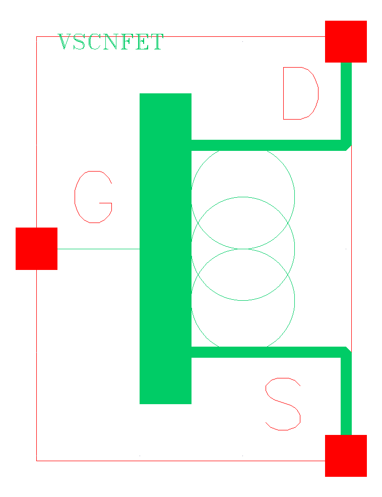
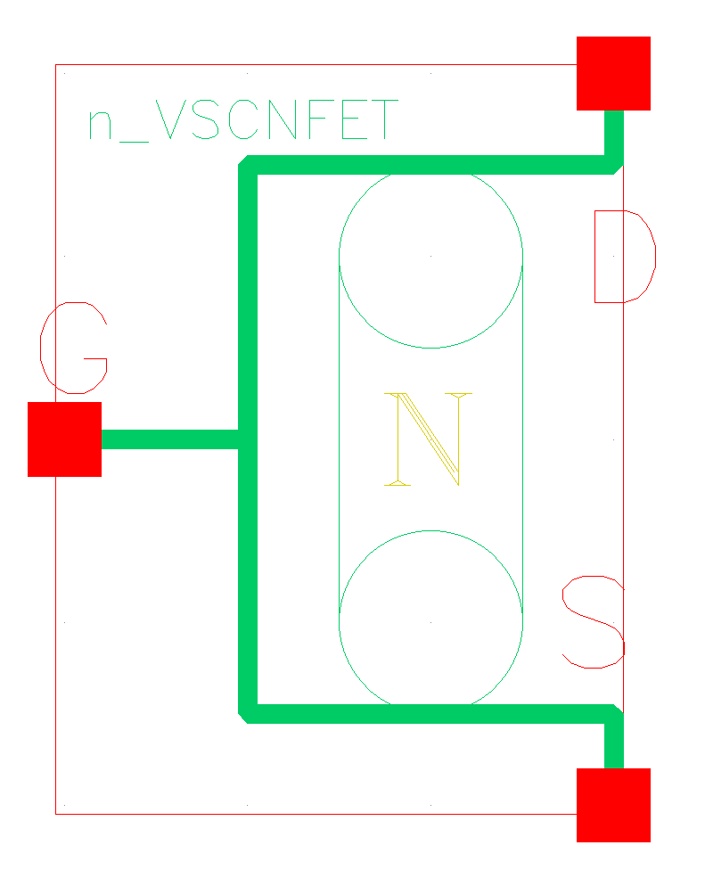
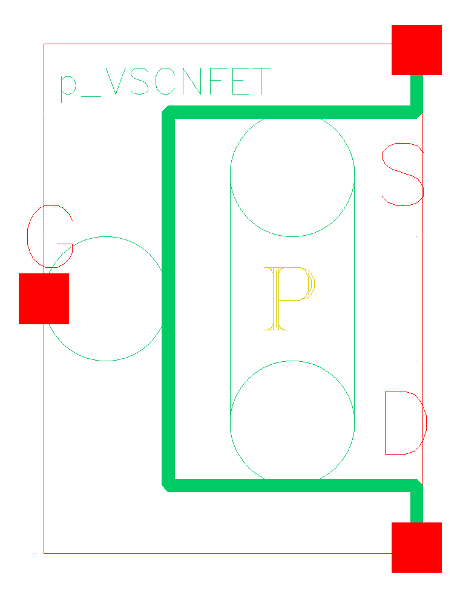
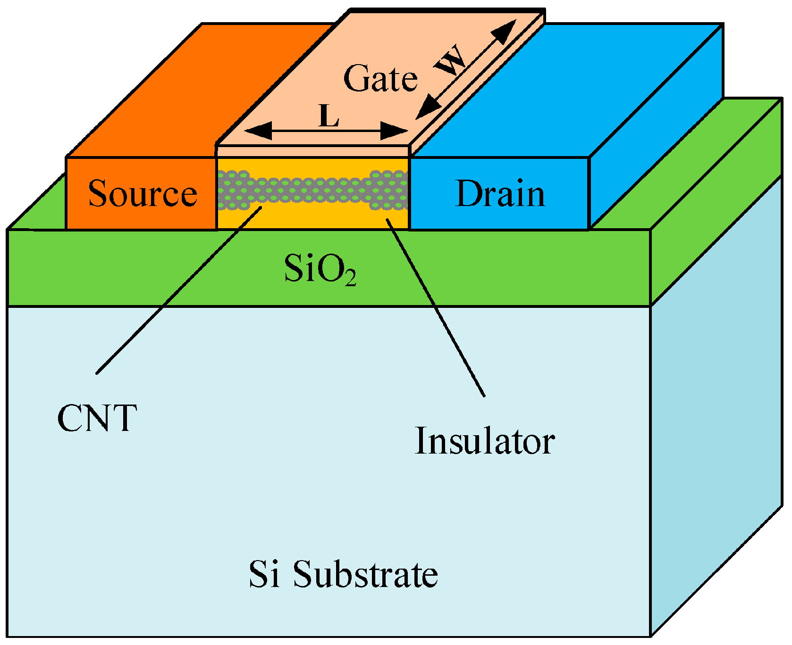

# VS-CNFET Model Configuration

[← Back to README](../README.md)

This document records the **final Stanford Virtual-Source CNFET model
configuration used for all VS-CNFET simulation results published in this
repository**.

Earlier exploratory parameter sets are not used here.

---

## Model Overview

The VS-CNFET circuits use the **Stanford Virtual-Source Carbon Nanotube
Field-Effect Transistor compact model v1.0.1**, integrated into Cadence
Virtuoso through Verilog-A.

The model provides n-type and p-type devices for complementary digital
circuit implementation.

### VS-CNFET Model Symbol



### Complementary Device Symbols

<table>
<tr>
<th align="center">n-type VS-CNFET</th>
<th align="center">p-type VS-CNFET</th>
</tr>
<tr>
<td></td>
<td></td>
</tr>
</table>

---

## Final 7nm Model Parameters

| Parameter | Value | Physical basis / configuration |
|---|---:|---|
| Gate length `Lg` | **10 nm** | 7nm-node study configuration; model valid over the selected range |
| Contact length `Lc` | **11 nm** | Final contact-length configuration |
| Extension `Lext` | **3 nm** | Source/drain extension |
| Gate oxide `tox` | **3 nm** | HfO₂ high-k dielectric |
| Permittivity `kox` | **23** | HfO₂ relative permittivity |
| CNT diameter `d` | **0.783 nm** | (10,0) zigzag CNT; `Eg ≈ 0.87 eV` |
| CNT pitch `s` | **10 nm** | Nominal density of 100 CNTs/µm |
| Flat-band voltage `Vfb` | **±0.015 V** | Complementary n/p configuration |
| `Efsd` | **0.258 eV** | Source/drain Fermi-level parameter |
| `SDTmod` | **1** | Source-to-drain tunnelling enabled |
| `BTBTmod` | **1** | Band-to-band tunnelling enabled |
| `Geomod` | **1** | Cylindrical GAA geometry |
| Supply `VDD` | **0.71 V** | Supply used in VS-CNFET circuit simulations |

This is the parameter set used for the final inverter, 38T full-adder and
10T full-adder simulations.

---

## CNT Channel

The final model uses a semiconducting:

```text
(10,0) zigzag carbon nanotube
```

with:

```text
CNT diameter d = 0.783 nm
CNT pitch    s = 10 nm
```

The selected diameter corresponds to an approximate bandgap of:

```text
Eg ≈ 0.87 eV
```

The 10 nm CNT pitch corresponds to a nominal linear density of:

```text
100 CNTs/µm
```

---

## Device Structure



*CNTFET device-structure illustration reproduced from Zahoor et al. under
CC BY 4.0. See [References](REFERENCES.md#6-cntfet-review).*

The selected model configuration uses cylindrical gate-all-around geometry:

```text
Geomod = 1
```

---

## Complementary Configuration

The same compact-model framework is used to represent complementary n-type
and p-type VS-CNFET devices.

The final flat-band settings are:

```text
n-type: Vfb = +0.015 V
p-type: Vfb = -0.015 V
```

This complementary configuration is used throughout the VS-CNFET inverter
and full-adder circuits.

---

## Tunnelling Configuration

Both tunnelling mechanisms used by the final model configuration are enabled:

```text
SDTmod  = 1
BTBTmod = 1
```

### `SDTmod`

Enables source-to-drain tunnelling behavior.

### `BTBTmod`

Enables band-to-band tunnelling behavior.

These mechanisms were retained in the simulations rather than disabled to
obtain more favorable leakage results.

This is relevant when interpreting the measured leakage characteristics.

---

## Supply Voltage

All final VS-CNFET circuits use:

```text
VDD = 0.71 V
```

The 45nm CMOS reference circuits use:

```text
VDD = 1.0 V
```

The comparison therefore evaluates each selected technology at its configured
supply rather than forcing both technologies to operate at an identical
voltage.

---

## Technology Comparison

| Property | 45nm CMOS | VS-CNFET |
|---|---|---|
| Model | GPDK045 | Stanford VS-CNFET v1.0.1 |
| Channel | Silicon | Carbon nanotube |
| Channel structure | Planar MOSFET | Cylindrical GAA CNFET |
| Gate length | 45 nm | 10 nm |
| CNT chirality | — | (10,0) |
| CNT diameter | — | 0.783 nm |
| CNT pitch | — | 10 nm |
| Supply | 1.0 V | 0.71 V |
| Simulator | Spectre | Spectre |
| Model interface | Cadence PDK | Verilog-A |

---

## Circuits Using This Configuration

The final parameter set is used in:

- VS-CNFET inverter
- VS-CNFET 38T static full adder
- VS-CNFET 10T PTL full adder

Incomplete exploratory CLA and SRAM designs are intentionally outside the
scope of the published comparison.

---

## Model Availability

The Stanford VS-CNFET model files themselves are **not redistributed** in
this repository.

This repository instead documents:

- the model used;
- the final parameter configuration;
- the resulting circuit implementations;
- the simulation methodology;
- the measured outputs.

Users wishing to reproduce the simulations should obtain the corresponding
model from its authorized source.

---

## Related Documentation

- [Main README](../README.md)
- [Measurement Methodology](MEASUREMENT_METHODOLOGY.md)
- [References](REFERENCES.md)